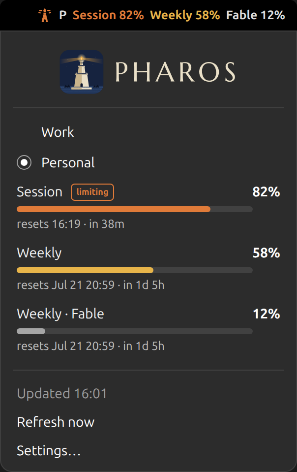

<div align="center">
  <picture>
    <source media="(prefers-color-scheme: dark)" srcset="assets/assets/pharos-logo-dark.svg">
    
  </picture>
  <p><em>Your Claude usage limits — session, weekly, per-model — in the GNOME top panel.</em></p>
  <p><a href="https://pharos.aymenkrifa.com"><b>pharos.aymenkrifa.com</b></a></p>
</div>

# Pharos

A colored light on the horizon, before you run onto the rocks. As usage
climbs, the beacon changes shape and color:

| Beacon | Meaning |
|:---:|---|
|  | **Clear water** — below 50% |
|  | **Light on the horizon** — from 50% |
|  | **Full beam** — from 75% |
|  | **On the rocks** — from 90% |

Click the beacon and the whole picture opens — every window, its own color,
and when each one resets:

<div align="center">
  
</div>

## Install

Needs GNOME Shell 46–48 and
[Claude Code](https://claude.com/product/claude-code) signed in on your
machine.

Download the [latest release](https://github.com/aymenkrifa/Pharos/releases/latest)
and install it:

```sh
curl -LO https://github.com/aymenkrifa/Pharos/releases/latest/download/pharos@aymenkrifa.github.io.shell-extension.zip
gnome-extensions install pharos@aymenkrifa.github.io.shell-extension.zip
```

Reload GNOME Shell (X11: `Alt+F2`, `r`, `Enter` — Wayland: log out and back
in), then:

```sh
gnome-extensions enable pharos@aymenkrifa.github.io
```

<details>
<summary>Install from source instead</summary>

```sh
git clone https://github.com/aymenkrifa/Pharos.git
cd Pharos
./install.sh
```

Then reload and enable as above.

</details>

## Features

- **Multi-account** — track work and personal Claude accounts side by side,
  with a switcher in the menu.
- **Discovers your limits** — session, weekly, and per-model windows,
  whatever your plan reports.
- **Configurable panel** — pick which limits show a number, which color the
  beacon, how the numbers are written, and the thresholds that trigger each
  color.

Full settings guide, with examples: **[pharos.aymenkrifa.com](https://pharos.aymenkrifa.com/#settings)**.

## License

GPL-2.0-or-later — see [LICENSE](LICENSE).

---

Made by [Aymen Krifa](https://aymenkrifa.com).
